# Semantic Graph for `AverageRotationalSpeed`


# Semantic Graph for `MaxRotationalSpeed`


# Semantic Graph for `StickSlipIndicator`

```mermaid
flowchart TD
	 classDef typeClass fill:#f96;
	 classDef classClass fill:#9dd0ff;
	 classDef opcClass fill:#ff9dd0;
	 classDef quantityClass fill:#d0ff9d;
	BaseStarStickSlipIndicator([BaseStarStickSlipIndicator]) --> opc:double([opc:double]):::opcClass
	BaseStarStickSlipIndicator_01([BaseStarStickSlipIndicator_01]) --> ComputedData([ComputedData]):::typeClass
	StickSlipIndicatorComputation([StickSlipIndicatorComputation]) --> Estimator([Estimator]):::typeClass
	BaseStarRotationalSpeed([BaseStarRotationalSpeed]) --> DynamicDrillingSignal([DynamicDrillingSignal]):::typeClass
	BaseStarRotationalSpeed_01([BaseStarRotationalSpeed_01]) --> DerivedMeasurement([DerivedMeasurement]):::typeClass
	GaussianUncertaintyBaseStarStickSlipIndicator_01([GaussianUncertaintyBaseStarStickSlipIndicator_01]) --> GaussianUncertainty([GaussianUncertainty]):::typeClass
	mudPulseTelemetry([mudPulseTelemetry]) --> MudPulseTelemetry([MudPulseTelemetry]):::typeClass
	stickSlipIncident([stickSlipIncident]) --> StickSlip([StickSlip]):::typeClass
	BHA_01([BHA_01]) --> BHAMechanicalLogicalElement([BHAMechanicalLogicalElement]):::typeClass
	Halliburton_01([Halliburton_01]) --> InstrumentationCompany([InstrumentationCompany]):::typeClass
	BaseStarStickSlipIndicator_01([BaseStarStickSlipIndicator_01]) -- http://ddhub.no/BelongsToClass --> ContinuousDataType([ContinuousDataType]):::classClass
	BaseStarRotationalSpeed_01([BaseStarRotationalSpeed_01]) -- http://ddhub.no/BelongsToClass --> ContinuousDataType([ContinuousDataType]):::classClass
	BaseStarStickSlipIndicator_01([BaseStarStickSlipIndicator_01]) -- http://ddhub.no/HasDynamicValue --> BaseStarStickSlipIndicator([BaseStarStickSlipIndicator]):::classClass
	BaseStarStickSlipIndicator_01([BaseStarStickSlipIndicator_01]) -- http://ddhub.no/IsOfMeasurableQuantity --> dimensionLessStandard([dimensionLessStandard]):::classClass
	BaseStarStickSlipIndicator_01([BaseStarStickSlipIndicator_01]) -- http://ddhub.no/IsTransformationOutput --> StickSlipIndicatorComputation([StickSlipIndicatorComputation]):::classClass
	BaseStarRotationalSpeed_01([BaseStarRotationalSpeed_01]) -- http://ddhub.no/HasDynamicValue --> BaseStarRotationalSpeed([BaseStarRotationalSpeed]):::classClass
	BaseStarRotationalSpeed_01([BaseStarRotationalSpeed_01]) -- http://ddhub.no/IsOfMeasurableQuantity --> angularVelocityDrilling([angularVelocityDrilling]):::classClass
	BaseStarRotationalSpeed_01([BaseStarRotationalSpeed_01]) -- http://ddhub.no/IsTransformationInput --> StickSlipIndicatorComputation([StickSlipIndicatorComputation]):::classClass
	BaseStarStickSlipIndicator_01([BaseStarStickSlipIndicator_01]) -- http://ddhub.no/HasUncertainty --> GaussianUncertaintyBaseStarStickSlipIndicator_01([GaussianUncertaintyBaseStarStickSlipIndicator_01]):::classClass
	GaussianUncertaintyBaseStarStickSlipIndicator_01([GaussianUncertaintyBaseStarStickSlipIndicator_01]) -- http://ddhub.no/HasUncertaintyMean --> BaseStarStickSlipIndicator_01([BaseStarStickSlipIndicator_01]):::classClass
	BaseStarStickSlipIndicator_01([BaseStarStickSlipIndicator_01]) -- http://ddhub.no/IsTransmittedBy --> mudPulseTelemetry([mudPulseTelemetry]):::classClass
	BaseStarStickSlipIndicator_01([BaseStarStickSlipIndicator_01]) -- http://ddhub.no/IsRelatedToDrillingIncident --> stickSlipIncident([stickSlipIncident]):::classClass
	BaseStarStickSlipIndicator_01([BaseStarStickSlipIndicator_01]) -- http://ddhub.no/IsMechanicallyLocatedAt --> BHA_01([BHA_01]):::classClass
	BaseStarRotationalSpeed_01([BaseStarRotationalSpeed_01]) -- http://ddhub.no/IsMechanicallyLocatedAt --> BHA_01([BHA_01]):::classClass
	BaseStarStickSlipIndicator_01([BaseStarStickSlipIndicator_01]) -- http://ddhub.no/IsProvidedBy --> Halliburton_01([Halliburton_01]):::classClass
	BaseStarRotationalSpeed_01([BaseStarRotationalSpeed_01]) -- http://ddhub.no/IsProvidedBy --> Halliburton_01([Halliburton_01]):::classClass
```


# Semantic Graph for `PeakRadialAcceleration`


# Semantic Graph for `AverageRadialAcceleration`


# Semantic Graph for `PeakAxialAcceleration`


# Semantic Graph for `AverageRawWeight`


# Semantic Graph for `MinRawWeight`


# Semantic Graph for `MaxRawWeight`


# Semantic Graph for `TareBitWeight`


# Semantic Graph for `AverageBitWeight`


# Semantic Graph for `MinBitWeight`


# Semantic Graph for `MaxBitWeight`


# Semantic Graph for `AverageRawTorque`


# Semantic Graph for `MinRawTorque`


# Semantic Graph for `MaxRawTorque`


# Semantic Graph for `TorqueBias`


# Semantic Graph for `AverageCorrectedTorque`


# Semantic Graph for `MinCorrectedTorque`


# Semantic Graph for `MaxCorrectedTorque`


# Semantic Graph for `AverageBitTorque`
```mermaid
flowchart TD
	 classDef typeClass fill:#f96;
	 classDef classClass fill:#9dd0ff;
	 classDef opcClass fill:#ff9dd0;
	 classDef quantityClass fill:#d0ff9d;
	BaseStarMeasuredAverageBitTorque([BaseStarMeasuredAverageBitTorque]) --> opc:double([opc:double]):::opcClass
	BaseStarMeasuredAverageBitTorque_01([BaseStarMeasuredAverageBitTorque_01]) --> DerivedMeasurement([DerivedMeasurement]):::typeClass
	MovingAverageBaseStarMeasuredAverageBitTorque([MovingAverageBaseStarMeasuredAverageBitTorque]) --> MovingAverage([MovingAverage]):::typeClass
	taringTransformationAverageBitTorque([taringTransformationAverageBitTorque]) --> SummationTransformation([SummationTransformation]):::typeClass
	BaseStarMeasuredAverageRawTorque_01([BaseStarMeasuredAverageRawTorque_01]) --> DerivedMeasurement([DerivedMeasurement]):::typeClass
	TorqueBiasForMudPulseTelemetry_01([TorqueBiasForMudPulseTelemetry_01]) --> ProcessData([ProcessData]):::typeClass
	GaussianUncertaintyBaseStarMeasuredAverageBitTorque_01([GaussianUncertaintyBaseStarMeasuredAverageBitTorque_01]) --> GaussianUncertainty([GaussianUncertainty]):::typeClass
	mudPulseTelemetry([mudPulseTelemetry]) --> MudPulseTelemetry([MudPulseTelemetry]):::typeClass
	Bit_01([Bit_01]) --> EndOfStringMechanicalLogicalElement([EndOfStringMechanicalLogicalElement]):::typeClass
	Halliburton_01([Halliburton_01]) --> InstrumentationCompany([InstrumentationCompany]):::typeClass
	BaseStarMeasuredAverageBitTorque_01([BaseStarMeasuredAverageBitTorque_01]) -- http://ddhub.no/BelongsToClass --> ContinuousDataType([ContinuousDataType]):::classClass
	BaseStarMeasuredAverageRawTorque_01([BaseStarMeasuredAverageRawTorque_01]) -- http://ddhub.no/BelongsToClass --> ContinuousDataType([ContinuousDataType]):::classClass
	TorqueBiasForMudPulseTelemetry_01([TorqueBiasForMudPulseTelemetry_01]) -- http://ddhub.no/BelongsToClass --> ContinuousDataType([ContinuousDataType]):::classClass
	BaseStarMeasuredAverageBitTorque_01([BaseStarMeasuredAverageBitTorque_01]) -- http://ddhub.no/HasDynamicValue --> BaseStarMeasuredAverageBitTorque([BaseStarMeasuredAverageBitTorque]):::classClass
	BaseStarMeasuredAverageBitTorque_01([BaseStarMeasuredAverageBitTorque_01]) -- http://ddhub.no/IsOfMeasurableQuantity --> torqueDrilling([torqueDrilling]):::classClass
	BaseStarMeasuredAverageBitTorque_01([BaseStarMeasuredAverageBitTorque_01]) -- http://ddhub.no/IsTransformationOutput --> MovingAverageBaseStarMeasuredAverageBitTorque([MovingAverageBaseStarMeasuredAverageBitTorque]):::classClass
	BaseStarMeasuredAverageRawTorque_01([BaseStarMeasuredAverageRawTorque_01]) -- http://ddhub.no/IsOfMeasurableQuantity --> torqueDrilling([torqueDrilling]):::classClass
	BaseStarMeasuredAverageRawTorque_01([BaseStarMeasuredAverageRawTorque_01]) -- http://ddhub.no/IsTransformationInput --> taringTransformationAverageBitTorque([taringTransformationAverageBitTorque]):::classClass
	TorqueBiasForMudPulseTelemetry_01([TorqueBiasForMudPulseTelemetry_01]) -- http://ddhub.no/IsOfMeasurableQuantity --> torqueDrilling([torqueDrilling]):::classClass
	TorqueBiasForMudPulseTelemetry_01([TorqueBiasForMudPulseTelemetry_01]) -- http://ddhub.no/IsTransformationInput --> taringTransformationAverageBitTorque([taringTransformationAverageBitTorque]):::classClass
	BaseStarMeasuredAverageBitTorque_01([BaseStarMeasuredAverageBitTorque_01]) -- http://ddhub.no/IsTransformationOutput --> taringTransformationAverageBitTorque([taringTransformationAverageBitTorque]):::classClass
	BaseStarMeasuredAverageBitTorque_01([BaseStarMeasuredAverageBitTorque_01]) -- http://ddhub.no/HasUncertainty --> GaussianUncertaintyBaseStarMeasuredAverageBitTorque_01([GaussianUncertaintyBaseStarMeasuredAverageBitTorque_01]):::classClass
	GaussianUncertaintyBaseStarMeasuredAverageBitTorque_01([GaussianUncertaintyBaseStarMeasuredAverageBitTorque_01]) -- http://ddhub.no/HasUncertaintyMean --> BaseStarMeasuredAverageBitTorque_01([BaseStarMeasuredAverageBitTorque_01]):::classClass
	BaseStarMeasuredAverageBitTorque_01([BaseStarMeasuredAverageBitTorque_01]) -- http://ddhub.no/IsTransmittedBy --> mudPulseTelemetry([mudPulseTelemetry]):::classClass
	BaseStarMeasuredAverageBitTorque_01([BaseStarMeasuredAverageBitTorque_01]) -- http://ddhub.no/IsMechanicallyLocatedAt --> Bit_01([Bit_01]):::classClass
	BaseStarMeasuredAverageBitTorque_01([BaseStarMeasuredAverageBitTorque_01]) -- http://ddhub.no/IsProvidedBy --> Halliburton_01([Halliburton_01]):::classClass
```

# Semantic Graph for `MinBitTorque`
```mermaid
flowchart TD
	 classDef typeClass fill:#f96;
	 classDef classClass fill:#9dd0ff;
	 classDef opcClass fill:#ff9dd0;
	 classDef quantityClass fill:#d0ff9d;
	BaseStarMeasuredMinBitTorque([BaseStarMeasuredMinBitTorque]) --> opc:double([opc:double]):::opcClass
	BaseStarMeasuredMinBitTorque_01([BaseStarMeasuredMinBitTorque_01]) --> DerivedMeasurement([DerivedMeasurement]):::typeClass
	MovingMinBaseStarMeasuredMinBitTorque([MovingMinBaseStarMeasuredMinBitTorque]) --> MovingMin([MovingMin]):::typeClass
	taringTransformationMinBitTorque([taringTransformationMinBitTorque]) --> SummationTransformation([SummationTransformation]):::typeClass
	BaseStarMeasuredMinRawTorque_01([BaseStarMeasuredMinRawTorque_01]) --> DerivedMeasurement([DerivedMeasurement]):::typeClass
	TorqueBiasForMudPulseTelemetry_01([TorqueBiasForMudPulseTelemetry_01]) --> ProcessData([ProcessData]):::typeClass
	GaussianUncertaintyBaseStarMeasuredMinBitTorque_01([GaussianUncertaintyBaseStarMeasuredMinBitTorque_01]) --> GaussianUncertainty([GaussianUncertainty]):::typeClass
	mudPulseTelemetry([mudPulseTelemetry]) --> MudPulseTelemetry([MudPulseTelemetry]):::typeClass
	Bit_01([Bit_01]) --> EndOfStringMechanicalLogicalElement([EndOfStringMechanicalLogicalElement]):::typeClass
	Halliburton_01([Halliburton_01]) --> InstrumentationCompany([InstrumentationCompany]):::typeClass
	BaseStarMeasuredMinBitTorque_01([BaseStarMeasuredMinBitTorque_01]) -- http://ddhub.no/BelongsToClass --> ContinuousDataType([ContinuousDataType]):::classClass
	BaseStarMeasuredMinRawTorque_01([BaseStarMeasuredMinRawTorque_01]) -- http://ddhub.no/BelongsToClass --> ContinuousDataType([ContinuousDataType]):::classClass
	TorqueBiasForMudPulseTelemetry_01([TorqueBiasForMudPulseTelemetry_01]) -- http://ddhub.no/BelongsToClass --> ContinuousDataType([ContinuousDataType]):::classClass
	BaseStarMeasuredMinBitTorque_01([BaseStarMeasuredMinBitTorque_01]) -- http://ddhub.no/HasDynamicValue --> BaseStarMeasuredMinBitTorque([BaseStarMeasuredMinBitTorque]):::classClass
	BaseStarMeasuredMinBitTorque_01([BaseStarMeasuredMinBitTorque_01]) -- http://ddhub.no/IsOfMeasurableQuantity --> torqueDrilling([torqueDrilling]):::classClass
	BaseStarMeasuredMinBitTorque_01([BaseStarMeasuredMinBitTorque_01]) -- http://ddhub.no/IsTransformationOutput --> MovingMinBaseStarMeasuredMinBitTorque([MovingMinBaseStarMeasuredMinBitTorque]):::classClass
	BaseStarMeasuredMinRawTorque_01([BaseStarMeasuredMinRawTorque_01]) -- http://ddhub.no/IsOfMeasurableQuantity --> torqueDrilling([torqueDrilling]):::classClass
	BaseStarMeasuredMinRawTorque_01([BaseStarMeasuredMinRawTorque_01]) -- http://ddhub.no/IsTransformationInput --> taringTransformationMinBitTorque([taringTransformationMinBitTorque]):::classClass
	TorqueBiasForMudPulseTelemetry_01([TorqueBiasForMudPulseTelemetry_01]) -- http://ddhub.no/IsOfMeasurableQuantity --> torqueDrilling([torqueDrilling]):::classClass
	TorqueBiasForMudPulseTelemetry_01([TorqueBiasForMudPulseTelemetry_01]) -- http://ddhub.no/IsTransformationInput --> taringTransformationMinBitTorque([taringTransformationMinBitTorque]):::classClass
	BaseStarMeasuredMinBitTorque_01([BaseStarMeasuredMinBitTorque_01]) -- http://ddhub.no/IsTransformationOutput --> taringTransformationMinBitTorque([taringTransformationMinBitTorque]):::classClass
	BaseStarMeasuredMinBitTorque_01([BaseStarMeasuredMinBitTorque_01]) -- http://ddhub.no/HasUncertainty --> GaussianUncertaintyBaseStarMeasuredMinBitTorque_01([GaussianUncertaintyBaseStarMeasuredMinBitTorque_01]):::classClass
	GaussianUncertaintyBaseStarMeasuredMinBitTorque_01([GaussianUncertaintyBaseStarMeasuredMinBitTorque_01]) -- http://ddhub.no/HasUncertaintyMean --> BaseStarMeasuredMinBitTorque_01([BaseStarMeasuredMinBitTorque_01]):::classClass
	BaseStarMeasuredMinBitTorque_01([BaseStarMeasuredMinBitTorque_01]) -- http://ddhub.no/IsTransmittedBy --> mudPulseTelemetry([mudPulseTelemetry]):::classClass
	BaseStarMeasuredMinBitTorque_01([BaseStarMeasuredMinBitTorque_01]) -- http://ddhub.no/IsMechanicallyLocatedAt --> Bit_01([Bit_01]):::classClass
	BaseStarMeasuredMinBitTorque_01([BaseStarMeasuredMinBitTorque_01]) -- http://ddhub.no/IsProvidedBy --> Halliburton_01([Halliburton_01]):::classClass
```

# Semantic Graph for `MaxBitTorque`
```mermaid
flowchart TD
	 classDef typeClass fill:#f96;
	 classDef classClass fill:#9dd0ff;
	 classDef opcClass fill:#ff9dd0;
	 classDef quantityClass fill:#d0ff9d;
	BaseStarMeasuredMaxBitTorque([BaseStarMeasuredMaxBitTorque]) --> opc:double([opc:double]):::opcClass
	BaseStarMeasuredMaxBitTorque_01([BaseStarMeasuredMaxBitTorque_01]) --> DerivedMeasurement([DerivedMeasurement]):::typeClass
	MovingMaxBaseStarMeasuredMaxBitTorque([MovingMaxBaseStarMeasuredMaxBitTorque]) --> MovingMax([MovingMax]):::typeClass
	taringTransformationMaxBitTorque([taringTransformationMaxBitTorque]) --> SummationTransformation([SummationTransformation]):::typeClass
	BaseStarMeasuredAverageRawTorque_01([BaseStarMeasuredAverageRawTorque_01]) --> DerivedMeasurement([DerivedMeasurement]):::typeClass
	TorqueBiasForMudPulseTelemetry_01([TorqueBiasForMudPulseTelemetry_01]) --> ProcessData([ProcessData]):::typeClass
	GaussianUncertaintyBaseStarMeasuredMaxBitTorque_01([GaussianUncertaintyBaseStarMeasuredMaxBitTorque_01]) --> GaussianUncertainty([GaussianUncertainty]):::typeClass
	mudPulseTelemetry([mudPulseTelemetry]) --> MudPulseTelemetry([MudPulseTelemetry]):::typeClass
	Bit_01([Bit_01]) --> EndOfStringMechanicalLogicalElement([EndOfStringMechanicalLogicalElement]):::typeClass
	Halliburton_01([Halliburton_01]) --> InstrumentationCompany([InstrumentationCompany]):::typeClass
	BaseStarMeasuredMaxBitTorque_01([BaseStarMeasuredMaxBitTorque_01]) -- http://ddhub.no/BelongsToClass --> ContinuousDataType([ContinuousDataType]):::classClass
	BaseStarMeasuredAverageRawTorque_01([BaseStarMeasuredAverageRawTorque_01]) -- http://ddhub.no/BelongsToClass --> ContinuousDataType([ContinuousDataType]):::classClass
	TorqueBiasForMudPulseTelemetry_01([TorqueBiasForMudPulseTelemetry_01]) -- http://ddhub.no/BelongsToClass --> ContinuousDataType([ContinuousDataType]):::classClass
	BaseStarMeasuredMaxBitTorque_01([BaseStarMeasuredMaxBitTorque_01]) -- http://ddhub.no/HasDynamicValue --> BaseStarMeasuredMaxBitTorque([BaseStarMeasuredMaxBitTorque]):::classClass
	BaseStarMeasuredMaxBitTorque_01([BaseStarMeasuredMaxBitTorque_01]) -- http://ddhub.no/IsOfMeasurableQuantity --> torqueDrilling([torqueDrilling]):::classClass
	BaseStarMeasuredMaxBitTorque_01([BaseStarMeasuredMaxBitTorque_01]) -- http://ddhub.no/IsTransformationOutput --> MovingMaxBaseStarMeasuredMaxBitTorque([MovingMaxBaseStarMeasuredMaxBitTorque]):::classClass
	BaseStarMeasuredAverageRawTorque_01([BaseStarMeasuredAverageRawTorque_01]) -- http://ddhub.no/IsOfMeasurableQuantity --> torqueDrilling([torqueDrilling]):::classClass
	BaseStarMeasuredAverageRawTorque_01([BaseStarMeasuredAverageRawTorque_01]) -- http://ddhub.no/IsTransformationInput --> taringTransformationMaxBitTorque([taringTransformationMaxBitTorque]):::classClass
	TorqueBiasForMudPulseTelemetry_01([TorqueBiasForMudPulseTelemetry_01]) -- http://ddhub.no/IsOfMeasurableQuantity --> torqueDrilling([torqueDrilling]):::classClass
	TorqueBiasForMudPulseTelemetry_01([TorqueBiasForMudPulseTelemetry_01]) -- http://ddhub.no/IsTransformationInput --> taringTransformationMaxBitTorque([taringTransformationMaxBitTorque]):::classClass
	BaseStarMeasuredMaxBitTorque_01([BaseStarMeasuredMaxBitTorque_01]) -- http://ddhub.no/IsTransformationOutput --> taringTransformationMaxBitTorque([taringTransformationMaxBitTorque]):::classClass
	BaseStarMeasuredMaxBitTorque_01([BaseStarMeasuredMaxBitTorque_01]) -- http://ddhub.no/HasUncertainty --> GaussianUncertaintyBaseStarMeasuredMaxBitTorque_01([GaussianUncertaintyBaseStarMeasuredMaxBitTorque_01]):::classClass
	GaussianUncertaintyBaseStarMeasuredMaxBitTorque_01([GaussianUncertaintyBaseStarMeasuredMaxBitTorque_01]) -- http://ddhub.no/HasUncertaintyMean --> BaseStarMeasuredMaxBitTorque_01([BaseStarMeasuredMaxBitTorque_01]):::classClass
	BaseStarMeasuredMaxBitTorque_01([BaseStarMeasuredMaxBitTorque_01]) -- http://ddhub.no/IsTransmittedBy --> mudPulseTelemetry([mudPulseTelemetry]):::classClass
	BaseStarMeasuredMaxBitTorque_01([BaseStarMeasuredMaxBitTorque_01]) -- http://ddhub.no/IsMechanicallyLocatedAt --> Bit_01([Bit_01]):::classClass
	BaseStarMeasuredMaxBitTorque_01([BaseStarMeasuredMaxBitTorque_01]) -- http://ddhub.no/IsProvidedBy --> Halliburton_01([Halliburton_01]):::classClass
```

# Semantic Graph for `ElectronicTemperature`
```mermaid
flowchart TD
	 classDef typeClass fill:#f96;
	 classDef classClass fill:#9dd0ff;
	 classDef opcClass fill:#ff9dd0;
	 classDef quantityClass fill:#d0ff9d;
	BaseStarMeasuredElectronicTemperature([BaseStarMeasuredElectronicTemperature]) --> opc:double([opc:double]):::opcClass
	BaseStarMeasuredElectronicTemperature_01([BaseStarMeasuredElectronicTemperature_01]) --> DerivedMeasurement([DerivedMeasurement]):::typeClass
	MovingAverageBaseStarMeasuredElectronicTemperature([MovingAverageBaseStarMeasuredElectronicTemperature]) --> MovingAverage([MovingAverage]):::typeClass
	GaussianUncertaintyBaseStarMeasuredElectronicTemperature_01([GaussianUncertaintyBaseStarMeasuredElectronicTemperature_01]) --> GaussianUncertainty([GaussianUncertainty]):::typeClass
	mudPulseTelemetry([mudPulseTelemetry]) --> MudPulseTelemetry([MudPulseTelemetry]):::typeClass
	topOfStringJunction_01([topOfStringJunction_01]) --> TopOfStringJunction([TopOfStringJunction]):::typeClass
	stringHydraulicBranch_01([stringHydraulicBranch_01]) --> HydraulicBranch([HydraulicBranch]):::typeClass
	annulusOutletJunction_01([annulusOutletJunction_01]) --> AnnulusOutletJunction([AnnulusOutletJunction]):::typeClass
	outletHydraulicBranch_01([outletHydraulicBranch_01]) --> HydraulicBranch([HydraulicBranch]):::typeClass
	BHA_01([BHA_01]) --> BHAMechanicalLogicalElement([BHAMechanicalLogicalElement]):::typeClass
	Halliburton_01([Halliburton_01]) --> InstrumentationCompany([InstrumentationCompany]):::typeClass
	BaseStarMeasuredElectronicTemperature_01([BaseStarMeasuredElectronicTemperature_01]) -- http://ddhub.no/BelongsToClass --> ContinuousDataType([ContinuousDataType]):::classClass
	BaseStarMeasuredElectronicTemperature_01([BaseStarMeasuredElectronicTemperature_01]) -- http://ddhub.no/HasDynamicValue --> BaseStarMeasuredElectronicTemperature([BaseStarMeasuredElectronicTemperature]):::classClass
	BaseStarMeasuredElectronicTemperature_01([BaseStarMeasuredElectronicTemperature_01]) -- http://ddhub.no/IsOfMeasurableQuantity --> temperatureDrilling([temperatureDrilling]):::classClass
	BaseStarMeasuredElectronicTemperature_01([BaseStarMeasuredElectronicTemperature_01]) -- http://ddhub.no/IsTransformationOutput --> MovingAverageBaseStarMeasuredElectronicTemperature([MovingAverageBaseStarMeasuredElectronicTemperature]):::classClass
	BaseStarMeasuredElectronicTemperature_01([BaseStarMeasuredElectronicTemperature_01]) -- http://ddhub.no/HasUncertainty --> GaussianUncertaintyBaseStarMeasuredElectronicTemperature_01([GaussianUncertaintyBaseStarMeasuredElectronicTemperature_01]):::classClass
	GaussianUncertaintyBaseStarMeasuredElectronicTemperature_01([GaussianUncertaintyBaseStarMeasuredElectronicTemperature_01]) -- http://ddhub.no/HasUncertaintyMean --> BaseStarMeasuredElectronicTemperature_01([BaseStarMeasuredElectronicTemperature_01]):::classClass
	BaseStarMeasuredElectronicTemperature_01([BaseStarMeasuredElectronicTemperature_01]) -- http://ddhub.no/IsTransmittedBy --> mudPulseTelemetry([mudPulseTelemetry]):::classClass
	topOfStringJunction_01([topOfStringJunction_01]) -- http://ddhub.no/HasDownstreamBranch --> stringHydraulicBranch_01([stringHydraulicBranch_01]):::classClass
	BaseStarMeasuredElectronicTemperature_01([BaseStarMeasuredElectronicTemperature_01]) -- http://ddhub.no/IsAssociatedToHydraulicBranch --> stringHydraulicBranch_01([stringHydraulicBranch_01]):::classClass
	annulusOutletJunction_01([annulusOutletJunction_01]) -- http://ddhub.no/HasUpstreamBranch --> outletHydraulicBranch_01([outletHydraulicBranch_01]):::classClass
	BaseStarMeasuredElectronicTemperature_01([BaseStarMeasuredElectronicTemperature_01]) -- http://ddhub.no/IsAssociatedToHydraulicBranch --> outletHydraulicBranch_01([outletHydraulicBranch_01]):::classClass
	BaseStarMeasuredElectronicTemperature_01([BaseStarMeasuredElectronicTemperature_01]) -- http://ddhub.no/IsMechanicallyLocatedAt --> BHA_01([BHA_01]):::classClass
	BaseStarMeasuredElectronicTemperature_01([BaseStarMeasuredElectronicTemperature_01]) -- http://ddhub.no/IsProvidedBy --> Halliburton_01([Halliburton_01]):::classClass
```

# Semantic Graph for `StringPressure`
```mermaid
flowchart TD
	 classDef typeClass fill:#f96;
	 classDef classClass fill:#9dd0ff;
	 classDef opcClass fill:#ff9dd0;
	 classDef quantityClass fill:#d0ff9d;
	BaseStarMeasuredStringPressure([BaseStarMeasuredStringPressure]) --> opc:double([opc:double]):::opcClass
	BaseStarMeasuredStringPressure_01([BaseStarMeasuredStringPressure_01]) --> DerivedMeasurement([DerivedMeasurement]):::typeClass
	MovingAverageBaseStarMeasuredStringPressure([MovingAverageBaseStarMeasuredStringPressure]) --> MovingAverage([MovingAverage]):::typeClass
	GaussianUncertaintyBaseStarMeasuredStringPressure_01([GaussianUncertaintyBaseStarMeasuredStringPressure_01]) --> GaussianUncertainty([GaussianUncertainty]):::typeClass
	mudPulseTelemetry([mudPulseTelemetry]) --> MudPulseTelemetry([MudPulseTelemetry]):::typeClass
	topOfStringJunction_01([topOfStringJunction_01]) --> TopOfStringJunction([TopOfStringJunction]):::typeClass
	stringHydraulicBranch_01([stringHydraulicBranch_01]) --> HydraulicBranch([HydraulicBranch]):::typeClass
	BHA_01([BHA_01]) --> BHAMechanicalLogicalElement([BHAMechanicalLogicalElement]):::typeClass
	Halliburton_01([Halliburton_01]) --> InstrumentationCompany([InstrumentationCompany]):::typeClass
	BaseStarMeasuredStringPressure_01([BaseStarMeasuredStringPressure_01]) -- http://ddhub.no/BelongsToClass --> ContinuousDataType([ContinuousDataType]):::classClass
	BaseStarMeasuredStringPressure_01([BaseStarMeasuredStringPressure_01]) -- http://ddhub.no/HasDynamicValue --> BaseStarMeasuredStringPressure([BaseStarMeasuredStringPressure]):::classClass
	BaseStarMeasuredStringPressure_01([BaseStarMeasuredStringPressure_01]) -- http://ddhub.no/IsOfMeasurableQuantity --> pressureDrilling([pressureDrilling]):::classClass
	BaseStarMeasuredStringPressure_01([BaseStarMeasuredStringPressure_01]) -- http://ddhub.no/IsTransformationOutput --> MovingAverageBaseStarMeasuredStringPressure([MovingAverageBaseStarMeasuredStringPressure]):::classClass
	BaseStarMeasuredStringPressure_01([BaseStarMeasuredStringPressure_01]) -- http://ddhub.no/HasUncertainty --> GaussianUncertaintyBaseStarMeasuredStringPressure_01([GaussianUncertaintyBaseStarMeasuredStringPressure_01]):::classClass
	GaussianUncertaintyBaseStarMeasuredStringPressure_01([GaussianUncertaintyBaseStarMeasuredStringPressure_01]) -- http://ddhub.no/HasUncertaintyMean --> BaseStarMeasuredStringPressure_01([BaseStarMeasuredStringPressure_01]):::classClass
	BaseStarMeasuredStringPressure_01([BaseStarMeasuredStringPressure_01]) -- http://ddhub.no/IsTransmittedBy --> mudPulseTelemetry([mudPulseTelemetry]):::classClass
	topOfStringJunction_01([topOfStringJunction_01]) -- http://ddhub.no/HasDownstreamBranch --> stringHydraulicBranch_01([stringHydraulicBranch_01]):::classClass
	BaseStarMeasuredStringPressure_01([BaseStarMeasuredStringPressure_01]) -- http://ddhub.no/IsAssociatedToHydraulicBranch --> stringHydraulicBranch_01([stringHydraulicBranch_01]):::classClass
	BaseStarMeasuredStringPressure_01([BaseStarMeasuredStringPressure_01]) -- http://ddhub.no/IsMechanicallyLocatedAt --> BHA_01([BHA_01]):::classClass
	BaseStarMeasuredStringPressure_01([BaseStarMeasuredStringPressure_01]) -- http://ddhub.no/IsProvidedBy --> Halliburton_01([Halliburton_01]):::classClass
```

# Semantic Graph for `AnnulusPressure`
```mermaid
flowchart TD
	 classDef typeClass fill:#f96;
	 classDef classClass fill:#9dd0ff;
	 classDef opcClass fill:#ff9dd0;
	 classDef quantityClass fill:#d0ff9d;
	BaseStarMeasuredAnnulusPressure([BaseStarMeasuredAnnulusPressure]) --> opc:double([opc:double]):::opcClass
	BaseStarMeasuredAnnulusPressure_01([BaseStarMeasuredAnnulusPressure_01]) --> DerivedMeasurement([DerivedMeasurement]):::typeClass
	MovingAverageBaseStarMeasuredAnnulusPressure([MovingAverageBaseStarMeasuredAnnulusPressure]) --> MovingAverage([MovingAverage]):::typeClass
	GaussianUncertaintyBaseStarMeasuredAnnulusPressure_01([GaussianUncertaintyBaseStarMeasuredAnnulusPressure_01]) --> GaussianUncertainty([GaussianUncertainty]):::typeClass
	mudPulseTelemetry([mudPulseTelemetry]) --> MudPulseTelemetry([MudPulseTelemetry]):::typeClass
	annulusOutletJunction_01([annulusOutletJunction_01]) --> AnnulusOutletJunction([AnnulusOutletJunction]):::typeClass
	outletHydraulicBranch_01([outletHydraulicBranch_01]) --> HydraulicBranch([HydraulicBranch]):::typeClass
	BHA_01([BHA_01]) --> BHAMechanicalLogicalElement([BHAMechanicalLogicalElement]):::typeClass
	Halliburton_01([Halliburton_01]) --> InstrumentationCompany([InstrumentationCompany]):::typeClass
	BaseStarMeasuredAnnulusPressure_01([BaseStarMeasuredAnnulusPressure_01]) -- http://ddhub.no/BelongsToClass --> ContinuousDataType([ContinuousDataType]):::classClass
	BaseStarMeasuredAnnulusPressure_01([BaseStarMeasuredAnnulusPressure_01]) -- http://ddhub.no/HasDynamicValue --> BaseStarMeasuredAnnulusPressure([BaseStarMeasuredAnnulusPressure]):::classClass
	BaseStarMeasuredAnnulusPressure_01([BaseStarMeasuredAnnulusPressure_01]) -- http://ddhub.no/IsOfMeasurableQuantity --> pressureDrilling([pressureDrilling]):::classClass
	BaseStarMeasuredAnnulusPressure_01([BaseStarMeasuredAnnulusPressure_01]) -- http://ddhub.no/IsTransformationOutput --> MovingAverageBaseStarMeasuredAnnulusPressure([MovingAverageBaseStarMeasuredAnnulusPressure]):::classClass
	BaseStarMeasuredAnnulusPressure_01([BaseStarMeasuredAnnulusPressure_01]) -- http://ddhub.no/HasUncertainty --> GaussianUncertaintyBaseStarMeasuredAnnulusPressure_01([GaussianUncertaintyBaseStarMeasuredAnnulusPressure_01]):::classClass
	GaussianUncertaintyBaseStarMeasuredAnnulusPressure_01([GaussianUncertaintyBaseStarMeasuredAnnulusPressure_01]) -- http://ddhub.no/HasUncertaintyMean --> BaseStarMeasuredAnnulusPressure_01([BaseStarMeasuredAnnulusPressure_01]):::classClass
	BaseStarMeasuredAnnulusPressure_01([BaseStarMeasuredAnnulusPressure_01]) -- http://ddhub.no/IsTransmittedBy --> mudPulseTelemetry([mudPulseTelemetry]):::classClass
	annulusOutletJunction_01([annulusOutletJunction_01]) -- http://ddhub.no/HasUpstreamBranch --> outletHydraulicBranch_01([outletHydraulicBranch_01]):::classClass
	BaseStarMeasuredAnnulusPressure_01([BaseStarMeasuredAnnulusPressure_01]) -- http://ddhub.no/IsAssociatedToHydraulicBranch --> outletHydraulicBranch_01([outletHydraulicBranch_01]):::classClass
	BaseStarMeasuredAnnulusPressure_01([BaseStarMeasuredAnnulusPressure_01]) -- http://ddhub.no/IsMechanicallyLocatedAt --> BHA_01([BHA_01]):::classClass
	BaseStarMeasuredAnnulusPressure_01([BaseStarMeasuredAnnulusPressure_01]) -- http://ddhub.no/IsProvidedBy --> Halliburton_01([Halliburton_01]):::classClass
```

